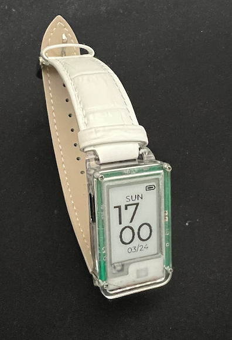

# xobdox:ink
xobdox:ink is designed to work with [xobdox](https://github.com/xqinx/xobdox) as
an addon display. However due to its small footprint it is also suitable for a
wearable device, and as a matter of fact I write the firmware (still WIP) for it
to be a smart watch first, the keyboard display firmware will follow soon.

## Features
* SeeedStudio Xiao BLE module based
* 1.02 inch e-ink display

### Smart Watch
#### Battery Life
|Battery capacity | Days(BLE off) | Days(BLE on) |
|-----------------|---------------|--------------|
|160mAh           |   5  |   3   |
|250mAh           |   7  |   5   |

*Note* I have not optimize the battery life yet, there're quite a few things I
can do to make it last longer

